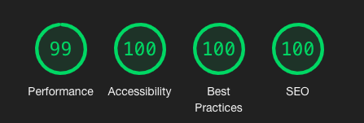

# gngtgg.space
Source code for personal website. Written in pure HTML, CSS and Javascript

### Built with

* [webpack](https://webpack.js.org/)
* [eslint](https://eslint.org/) with [airbnb config](https://github.com/airbnb/javascript)
* [babel](https://github.com/babel/babel)
* [autoprefixer](https://github.com/postcss/autoprefixer)
* [normalize.css](https://necolas.github.io/normalize.css/)

### How to Run

To run the app locally:

```sh
git clone git@github.com:goingtogogo/gngtgg.space.git
cd gngtgg.space
npm install
npm run dev
```

### Lighthouse score

